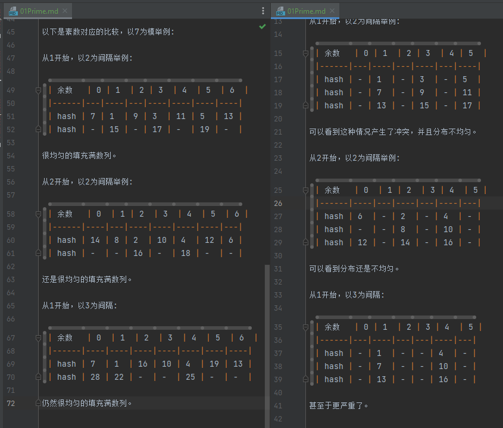
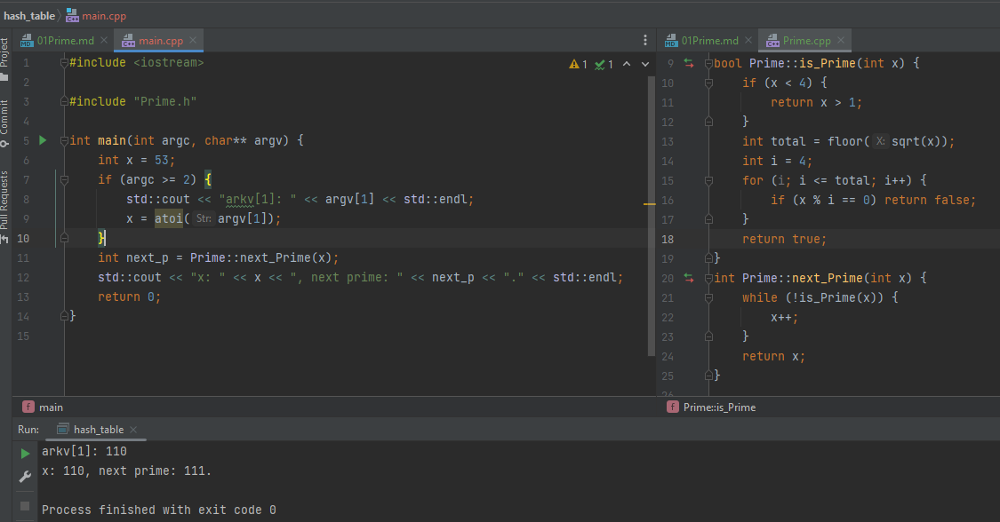

# Prime 素数

`素数`是: 2, 3, 5, 7, 11...

定义: 大于1的整数，只能被自身和1 整除的数, 2是最小素数，且也是唯一个偶数。

## 为什么素数

素数的定义决定了他如果被作为模，则碰撞冲突是最少的。

假如使用合数6为模:

从1开始，以2为间隔举例:

| 余数   | 0 | 1  | 2 | 3  | 4 | 5  |
|------|---|----|---|----|---|----|
| hash | - | 1  | - | 3  | - | 5  |
| hash | - | 7  | - | 9  | - | 11 |
| hash | - | 13 | - | 15 | - | 17 |

可以看到这种情况产生了冲突，并且分布不均匀。

从2开始，以2为间隔举例:

| 余数   | 0  | 1 | 2  | 3 | 4  | 5 |
|------|----|---|----|---|----|---|
| hash | 6  | - | 2  | - | 4  | - |
| hash | -  | - | 8  | - | 10 | - |
| hash | 12 | - | 14 | - | 16 | - |

可以看到分布还是不均匀。

从1开始，以3为间隔:

| 余数   | 0 | 1  | 2 | 3 | 4  | 5 |
|------|---|----|---|---|----|---|
| hash | - | 1  | - | - | 4  | - |
| hash | - | 7  | - | - | 10 | - |
| hash | - | 13 | - | - | 16 | - |

甚至于更严重了。

---

以下是素数对应的比较，以7为模举例:

从1开始，以2为间隔举例:

| 余数   | 0 | 1  | 2 | 3  | 4  | 5  | 6  |
|------|---|----|---|----|----|----|----|
| hash | 7 | 1  | 9 | 3  | 11 | 5  | 13 |
| hash | - | 15 | - | 17 | -  | 19 | -  |

很均匀的填充满数列。

从2开始，以2为间隔举例:

| 余数   | 0  | 1 | 2  | 3  | 4  | 5  | 6 |
|------|----|---|----|----|----|----|---|
| hash | 14 | 8 | 2  | 10 | 4  | 12 | 6 |
| hash | -  | - | 16 | -  | 18 | -  | - |

还是很均匀的填充满数列。

从1开始，以3为间隔:

| 余数   | 0  | 1  | 2  | 3  | 4  | 5  | 6  |
|------|----|----|----|----|----|----|----|
| hash | 7  | 1  | 16 | 10 | 4  | 19 | 13 |
| hash | 28 | 22 | -  | -  | 25 | -  | -  |

仍然很均匀的填充满数列。



## 实现

如果是暴力计算 is_prime = !(x % i == 0), 浪费重复计算。

优化为x =  a * b, 那么最大乘数a = sqrt(x):

判别最小的素数`2`/`3`:

```c++
bool is_Prime(int x) {
    if (x < 4) {
        return x > 1;
    }
```

然后判别>= 4的素数:

```cpp
bool is_Prime(int x) {
    ...
    int total = floor(sqrt(x));
    int i = 4;
    for (i; i <= total; i++) {
        if (x % i == 0) return false;
    }
    return true;
}
```

再补充一个寻找下一个素数的方法，如x = 6, 返回7:

```c++
int next_Prime(int x) {
    while (!is_Prime(x)) {
        x++;
    }
    return x;
}
```



## 参考

[算法分析：哈希表的大小为何是素数](https://blog.csdn.net/zhishengqianjun/article/details/79087525)