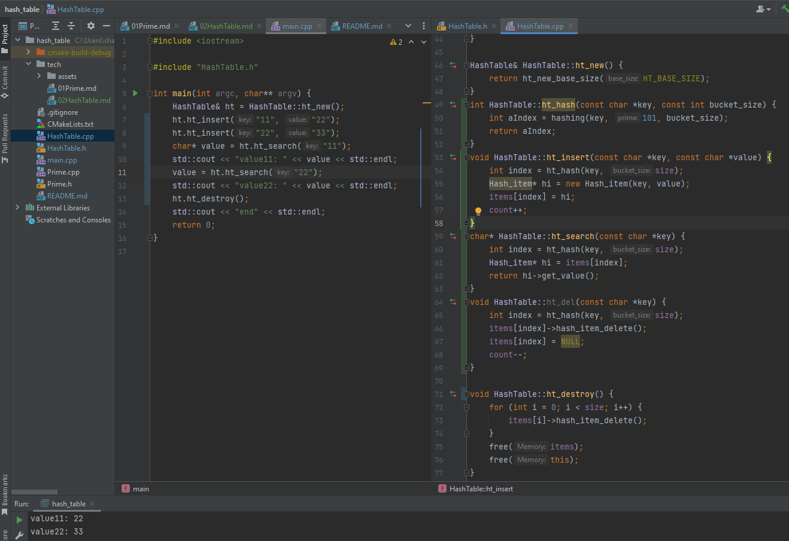

# Hashing & HashTable

这章实现hashing 方法及实现HashTable的insert/search/delete方法.

## Hashing

给定初始长度为53的数组容器，insert一个key时计算其落在哪个位置。我们选择将key转换为放大的数字，然后对53取模:

```
const int base = 151, size = 53;
hashing("cat", bsae, size)

hash = (pow(151, 2) * 99 + pow(151, 1) * 97 + pow(151, 0) * 116) % 53
hash = (2257299 + 14647 + 116) % 53
hash = (2272062) % 53
hash = 5
```

对应的方法如:

```c++
int hashing(const char* key, int prime, int bucket_size) {
    int hash = 0;
    int key_len = strlen(key);
    for (int i = 0; i < key_len; i++) {
        hash = (pow(prime, key_len-(i+1)) * int(key[i]));
    }
    return hash % bucket_size;
}
```

将key取模后得到位置信息，我们将他带入insert 看下结果:

```c++
// 新增ht_hash方法计算索引
int HashTable::ht_hash(const char *key, const int bucket_size) {
    int aIndex = hashing(key, 101, bucket_size);
    return aIndex;
}
void HashTable::ht_del(const char *key) {
    int index = ht_hash(key, size);
    items[index]->hash_item_delete();
    items[index] = NULL;
    count--;
}

void HashTable::ht_insert(const char *key, const char *value) {
    int index = ht_hash(key, size);
    Hash_item* hi = new Hash_item(key, value);
    items[index] = hi;
    count++;
}
```

`ht_insert`目前简单的直接设置，不管内存泄露、替换等等情况；`ht_del`的逻辑则相反的直接删除。

## HashTable

`HashTable` 负责管理hash数据处理过程； Hash_item 用来承载实际数据。生成HashTable 时需注意的是: base_size 记录该次提供的基础大小，base_size 计算下一个素数得到size大小:

```c++
HashTable& HashTable::ht_new_base_size(int base_size) {
    int next_prime = Prime::next_Prime(base_size);
    HashTable* ht = new HashTable(base_size, next_prime);

    return *ht;
}
```

