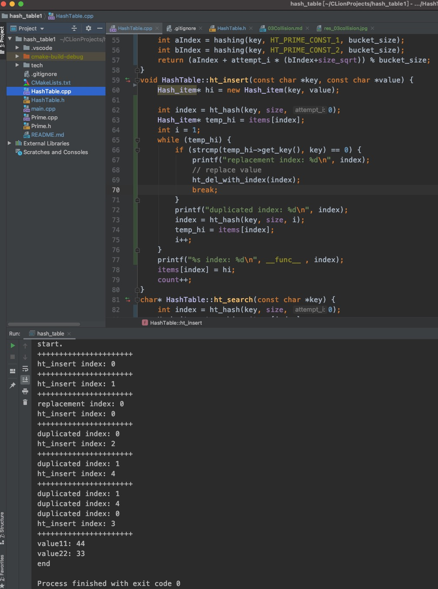

# Collision

如果容器固定，不同的key会产生冲突，解决Hashtable的冲突有多种方法，这里使用二次hash的开放寻址法。

## Double Hash

        index = (hashing(key) + i * hashing(key)) % bucket_size

初次取位置时i = 0， 如果没有冲突，那么位置信息则确定；如果有冲突，那么以此公式计算下一个位置，直到没有冲突。

以上`i` 可能为0， `hashing(key)`也可能为0，为了防止hashing(key) = 0带来的失误，公式优化为:

        index = (hashing(key) + i * (hashing(key)+1)) % bucket_size

如果`(hash_b + 1)` == `num_buckets` 也会出现模的倍数而不断轮询的bug，所以增加方法防止数值是模的倍数:

        index = floor_mod(bucket_size, (hashing(key) + 1));

修改`ht_hash` 方法为:

```c++
+static int floor_mod(const int mod_num, const int check_num) {
+   return check_num % mod_num == 0 ? check_num - 1 : check_num;
+}
-int HashTable::ht_hash(const char *key, const int bucket_size) {
+int HashTable::ht_hash(const char *key, const int bucket_size, int attempt_i) {
    int aIndex = hashing(key, HT_PRIME_CONST_1, bucket_size);
-   return aIndex;
+   const int aIndex = hashing(key, HT_PRIME_CONST_1, bucket_size);
+   const int bIndex = hashing(key, HT_PRIME_CONST_2, bucket_size);
+   const int mod_index = floor_mod(bucket_size, (bIndex + 1));
+   return (aIndex + attempt_i * mod_index) % bucket_size;
}
```

以上通过接收attempt_i来解决冲突后寻找下一个位置，任何冲突发生都按照该公式执行。理论上容器够大，则都能找到对应的位置。

下面实现`ht_insert`，之前直接设置指针覆盖，优化后能正确执行替换/重新寻址:

```c++
void HashTable::ht_insert(const char *key, const char *value) {
    Hash_item* hi = new Hash_item(key, value);

    int index = ht_hash(key, size, 0);
    Hash_item* temp_hi = items[index];
    int i = 1;
    while (temp_hi) {
        if (strcmp(temp_hi->get_key(), key) == 0) {
            // replace value
            ht_del_with_index(index);
            break;
        }
        index = ht_hash(key, size, i);
        temp_hi = items[index];
        i++;
    }
    items[index] = hi;
    count++;
}
```

首先attempt_i 设置为0，查看容器中该位置是否有值，while 循环查询开放寻址中没有值后才设置；否则判断key是否相同，相同则执行替换，否则再次执行寻址。

`ht_search` 和`ht_del` 逻辑与`ht_insert` 一致。

